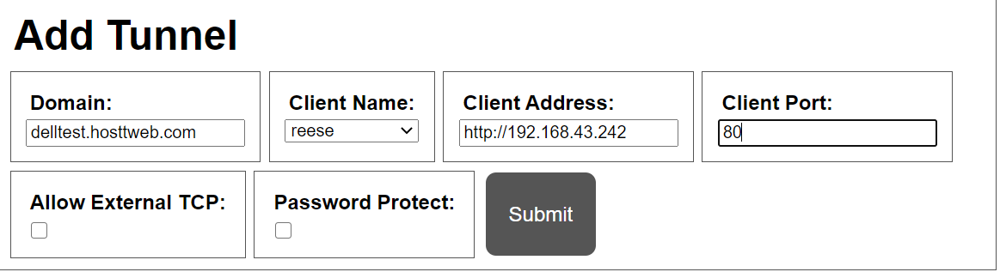

# Boring Proxy Server for YunoHost

[](https://dash.yunohost.org/appci/app/example)    
[](https://install-app.yunohost.org/?app=example)

*[Lire ce readme en français.](./README_fr.md)*

> *This package allows you to install Boring Proxy Server quickly and simply on a YunoHost server.
If you don't have YunoHost, please consult [the guide](https://yunohost.org/#/install) to learn how to install it.*

## Overview

boringproxy is a combination of a reverse proxy and a tunnel manager.

What that means is if you have a self-hosted web service (Nextcloud, Emby, Jellyfin, etherpad, personal website, etc.) running on a private network (such as behind a NAT at home), boringproxy aims to provide the easiest way to securely (i.e. HTTPS and optional password-protection) expose that server to the internet, so you can access it from anywhere.

### Features

 - 100% free and open source under the MIT license.
 - Designed from the ground up with self-hosters in mind.
 - No more port forwarding, NAT traversal, firewall rules, HTTPS certificate management, etc etc. Let boringproxy handle it all for you.
 - No config files. Seriously, none. It has nice defaults and the few knobs are easily adjusted with simple CLI parameters.
 - Lightning fast web GUI for managing tunnels from one central place. It even works great on mobile browsers.
 - Fully configurable through a HTTP API.
 - The client software works on Linux, Windows, Mac, and ARM (i.e. Raspberry Pi and Android).
 - Ships as single executable which contains both the server and client.
 - SSH under the hood. You can use a standard SSH client if you prefer.
 - End-to-end encryption (since version 0.4.0). Choose whether to terminate TLS at the server, client, or your application. All handled seamlessly with Let's Encrypt integration.


**Shipped version:** 0.10.0~ynh1

## Screenshots



## Documentation and resources

* Official app website: <https://boringproxy.io/>
* Official user documentation: <https://boringproxy.io/usage>
* Upstream app code repository: <https://github.com/boringproxy/boringproxy>
* YunoHost documentation for this app: <https://yunohost.org/app_example>
* Report a bug: <https://github.com/YunoHost-Apps/example_ynh/issues>

## Developer info

Please send your pull request to the [testing branch](https://github.com/YunoHost-Apps/example_ynh/tree/testing).

To try the testing branch, please proceed like that.

``` bash
sudo yunohost app install https://github.com/skyuk3000/BoringProxyServer_ynh/ --debug
or
sudo yunohost app upgrade example -u https://github.com/skyuk3000/BoringProxyServer_ynhtree/testing --debug
```

**More info regarding app packaging:** <https://yunohost.org/packaging_apps>
